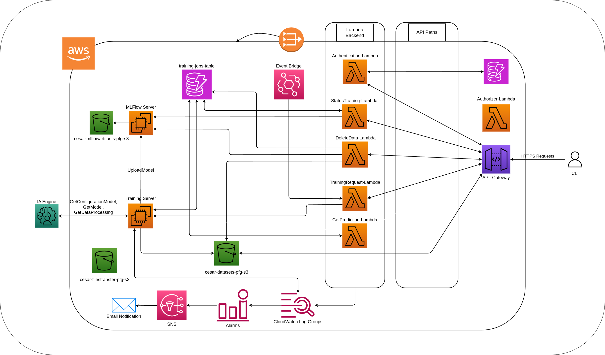

# Diseño e Implementación de una Arquitectura en la Nube para la Gestión del Ciclo de Vida de Modelos Basados en Machine Learning

> **Nota**: Este repositorio constituye el Anexo Técnico y el código fuente del Trabajo de Fin de Grado defendido en la ETSISI - UPM.

<p align="center">
  
</p>

<p align="center">
  
  
  
  
  
  
</p>

## Descripción

Este proyecto propone el diseño y desarrollo de una arquitectura **MLOps nativa en la nube (AWS)** basada en un enfoque de **intervención humana nula** (*zero-touch pipeline*). El objetivo principal es automatizar integralmente los procesos de preparación de datos, entrenamiento, despliegue y mantenimiento predictivo de modelos de Machine Learning.

El flujo operativo se inicia automáticamente tras la ingesta de los datos finales, activando una fase de preprocesamiento inteligente donde agentes de Inteligencia Artificial y LLMs depuran y transforman la información para su optimización. A continuación, el sistema orquesta un proceso de **AutoML** que itera sobre múltiples algoritmos y ajusta dinámicamente los hiperparámetros para identificar el modelo con el mejor rendimiento. El modelo resultante es versionado y registrado de forma automática en **MLflow**, garantizando la trazabilidad completa de metadatos, parámetros y artefactos.

Para asegurar la fiabilidad a largo plazo, la plataforma integra un sistema de inferencia con monitorización continua de la degradación de los datos (*data drift*). Si las métricas de precisión caen por debajo de un umbral predefinido, la arquitectura dispara automáticamente un *pipeline* de reentrenamiento continuo (**Continuous Training**), fusionando los datos históricos con las nuevas observaciones.

## Arquitectura

<p align="center">
  
</p>

### Componentes principales

- **API-CLI**: Cliente de línea de comandos desarrollado en Go (cobra) que interactúa con la API Gateway.
- **API Gateway**: Punto de entrada único a la plataforma. Expone 5 endpoints REST.
- **AWS Lambda**: 4 funciones Python 3.12 que orquestan autenticación, inicio de entrenamiento, consulta de estado y eliminación de datos.
- **Training EC2**: Instancia `t4g.small` que ejecuta la lógica de AutoML y un servicio FastAPI/uvicorn (puerto 8080) para recibir peticiones desde Lambda.
- **MLflow EC2**: Instancia `t4g.small` dedicada al tracking server de MLflow (puerto 8080), con artefactos almacenados en S3.
- **S3**: 3 buckets para datasets (`mock-datasets-pfg-s3`), transferencia de código (`mock-filestransfer-pfg-s3`) y artefactos de MLflow (`mock-mlflowartifacts-pfg-s3`).
- **DynamoDB**: Tabla `users-auth-table` (modo `PAY_PER_REQUEST`) para autenticación y metadatos.
- **Terraform**: Infraestructura como código que despliega todos los recursos AWS.

## Stack tecnológico

| Capa | Tecnología | Propósito |
|------|-----------|-----------|
| CLI | Go | Cliente de línea de comandos |
| API | AWS API Gateway | Punto de entrada REST |
| Serverless | AWS Lambda | Orquestación de operaciones |
| Compute | AWS EC2 (t4g.small) | Training Server + MLflow Server |
| Storage | AWS S3 | Datasets, artefactos, transferencia de código |
| Database | AWS DynamoDB | Metadatos de usuarios y estado |
| Training | Python 3.12 + scikit-learn | Motor de AutoML |
| Tracking | MLflow | Versionado y registro de modelos |
| REST API | FastAPI + Uvicorn | Listener en Training Server (puerto 8080) |
| IaC | Terraform | Despliegue de infraestructura AWS |
| IA | OpenCode (API OpenAI) | Motor LLM para análisis de datasets y selección de algoritmos |

## Estructura del proyecto

```
ProyectoPFG/
├── API-CLI/              # CLI en Go (cobra)
│   └── go.mod            # Módulo Go 1.25.3 + cobra v1.10.1
├── LambdaCode/           # Funciones AWS Lambda (Python 3.12)
│   ├── Authentication/
│   ├── DeleteData/
│   ├── GetPrediction/
│   ├── GetTrainingStatus/
│   └── TrainingRequest/
├── TrainingServer/       # Servicios en EC2
│   ├── TrainingService/  # Lógica de AutoML + MLflow
│   └── ListenerREST/     # FastAPI/uvicorn (puerto 8080)
├── Infrastructure/       # Terraform (AWS)
│   ├── extrafiles/       # Scripts de bootstrap
│   │   ├── TrainingServer.sh
│   │   └── MLFlowServer.sh
│   └── *.tf              # Recursos AWS
├── TFG/                  # Memoria LaTeX
│   ├── capitulos/
│   ├── imagenes/
│   ├── main.tex
│   └── export.bib
└── Workflow/             # Documentación y notas de investigación
```

## Requisitos previos

- Cuenta de AWS con acceso programático configurado
- Terraform >= 1.14.9
- Go >= 1.25.3
- Python 3.12
- AWS CLI configurado (`aws configure`)

## Despliegue rápido

```bash
# 1. Clonar repositorio
git clone <repo-url>
cd ProyectoPFG

# 2. Desplegar infraestructura AWS
cd Infrastructure
terraform init
terraform plan
terraform apply

# 3. Compilar CLI
cd ../API-CLI
go build -o api-cli .

# 4. Usar la plataforma
# Primero, autentícate (esto guardará la sesión y la URL localmente)
./api-cli login --source <API_GATEWAY_URL> --username <tu_usuario>

# Luego, puedes operar sin volver a especificar la URL
./api-cli upload --dataset <path_al_csv>
./api-cli start-training --dataset-name <nombre_archivo_csv>
./api-cli get-status --dataset-name <nombre_archivo_csv>
./api-cli predict --dataset-name <nombre_archivo_csv> --json-data <datos>
./api-cli delete --dataset-name <nombre_archivo_csv>
```

> **Nota**: El comando `login` requiere las flags `--source` y `--username`. La URL y el token se guardan localmente de forma segura, por lo que no es necesario repetir la flag `--source` en los comandos posteriores.

## Endpoints de la API

| Método | Endpoint | Descripción |
|--------|----------|-------------|
| GET | `/auth?userName=<name>` | Autenticación de usuarios |
| PUT | `/upload?user=<name>&fileName=<name>` | Subida de datasets a S3 |
| POST | `/training-start` | Inicia entrenamiento AutoML |
| GET | `/get-status?datasetName=<name>&userName=<name>` | Estado del entrenamiento |
| DELETE | `/delete-data?datasetName=<name>&userName=<name>` | Elimina dataset y recursos asociados |

## Funcionamiento del pipeline

1. **Ingesta**: El usuario sube un dataset mediante el CLI → almacenamiento en S3 (`mock-datasets-pfg-s3`).
2. **Trigger**: El usuario solicita inicio de entrenamiento mediante CLI → API Gateway → Lambda `TrainingRequest` → petición HTTP al Training EC2 (ListenerREST en puerto 8080).
3. **Entrenamiento Inteligente**: El Training Server ejecuta:
   - Preprocesamiento y análisis exploratorio (EDA) asistido por LLM.
   - Recomendación automatizada del mejor algoritmo de ML (scikit-learn) y sus hiperparámetros óptimos generados por IA en base a las características del dataset.
   - Entrenamiento y evaluación del modelo recomendado.
4. **Registro**: El modelo resultante se versiona automáticamente en MLflow, garantizando la trazabilidad completa de metadatos, métricas, parámetros y código.

## Características clave

- **Zero-touch pipeline**: Automatización completa desde la ingesta de datos hasta el entrenamiento y registro del modelo.
- **Selección de modelo por IA**: Recomendación automática del mejor algoritmo y configuración de hiperparámetros asistida por LLM sin intervención manual.
- **Trazabilidad total**: MLflow registra todos los experimentos, modelos, métricas y artefactos.
- **Serverless**: API Gateway + Lambda para escalabilidad elástica y bajo coste operativo.
- **Open Source**: Stack tecnológico 100% libre (Go BSD, Python PSF, Terraform MPL-2.0, MLflow Apache-2.0).


## Problemas conocidos / TODO

- [ ] **Sesgo algorítmico**: El proceso no incluye actualmente métricas de *fairness*. Pendiente integrar librerías como `fairlearn` o `aif360`.
- [ ] **Privacidad**: No se ha implementado cifrado explícito con AWS KMS ni anonimización de datos sensibles.
- [ ] **Conectividad**: La plataforma requiere acceso a Internet, lo que limita su uso en zonas sin cobertura adecuada.
- [ ] **Balanceo de carga**: Actualmente una única instancia EC2 atiende las peticiones de entrenamiento. Pendiente evaluar auto-scaling o balanceo con ALB.
- [ ] **Memoria insuficiente (OOM)**: Debido a las limitaciones de la instancia `t4g.small` de la capa gratuita (1 GB RAM), el servidor MLflow puede ser terminado por el sistema (*OOM-killed*) al cargar modelos grandes o gestionar múltiples artefactos. Se recomienda utilizar una instancia con mayor capacidad de RAM (por ejemplo, `t4g.medium` o superior) para entornos de producción.
- [ ] **Monitorización y Reentrenamiento**: Implementar detección de *data drift* y pipelines de *Continuous Training* automatizados en el entorno de producción.


## Licencia

El código fuente del proyecto se distribuye bajo licencia abierta para fines académicos y de investigación.

---

<p align="center">
  <sub>Desarrollado como Trabajo Fin de Grado en la ETSISI - UPM</sub>
</p>
